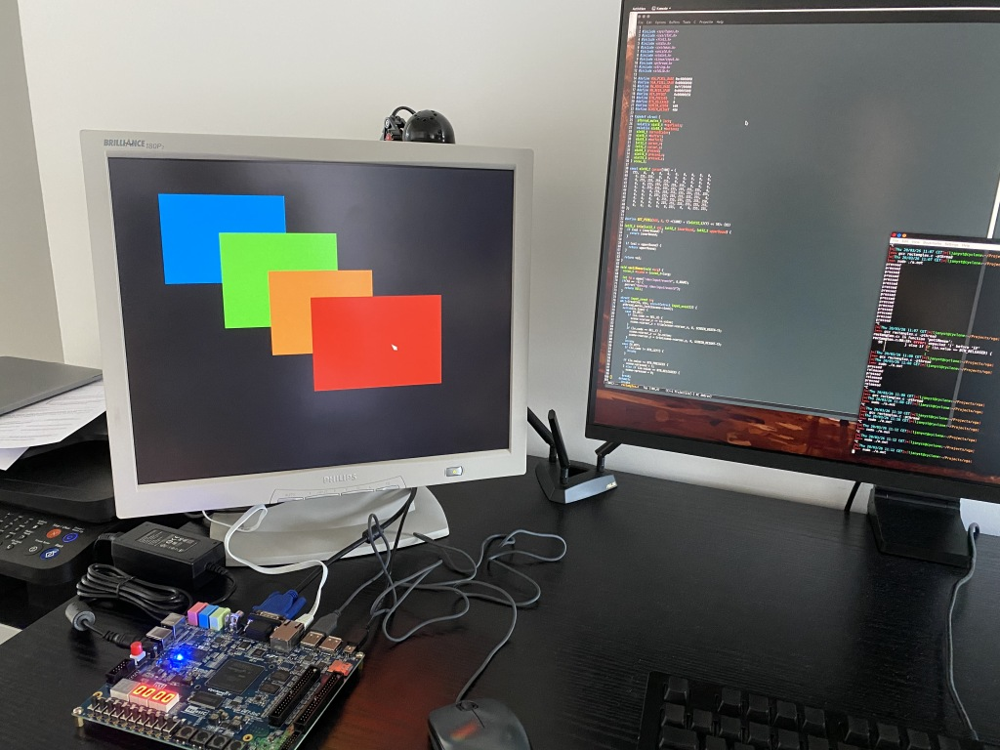

VGA
===

This system implements the Hard Processor System with the push buttons exposed
at `0xff200000`, and an VGA frame buffer at `0xc8000000`. Follow the
instructions in the master README file to install it in the target board. The sw
subdirectory contains a program that reads the the movements of a USB-attached
mouse, paints the moving pointer at the relevant position of the screen, and
lets you draw rectangles with the left mouse button and the color selected using
the push buttons on the board.

